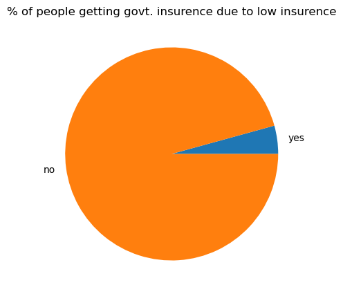

```python
import numpy as np
import pandas as pd
import matplotlib.pyplot as plt
import seaborn as sns

# Load the dataset
data = pd.read_csv("C:/Users/varun/Downloads/DoctorVisits - DA.csv")
```


```python
# Display basic information about the dataset
print("Dataset Information:")
print(data.info())
```


```python
# Summary statistics
print("\nSummary Statistics:")
print(data.describe())
```

# Interactive Data Exploration


```python
while True:
    print("\nColumn Options:")
    print("1. Gender")
    print("2. Illness")
    print("3. Income")
    print("4. Age")
    print("5. Exit")

    choice = input("\nEnter the number corresponding to the column or analysis option you want to explore (or '6' to exit): ")

    if choice == '5':
        break

    if choice == '1':
        # Analyze Gender column
        gender_counts = data['gender'].value_counts()
        print("\nGender Counts:")
        print(gender_counts)

        # Plot a pie chart for gender distribution
        plt.figure(figsize=(5, 5))
        plt.pie(gender_counts, labels=gender_counts.index, autopct='%1.1f%%', colors=['skyblue', 'lightcoral'])
        plt.title("Gender Distribution")
        plt.show()

    elif choice == '2':
        # Analyze Illness column
        illness_counts = data['illness'].value_counts()
        print("\nIllness Counts:")
        print(illness_counts)

        # Plot a bar chart for illness distribution
        plt.figure(figsize=(8, 5))
        sns.barplot(x=illness_counts.index, y=illness_counts.values, palette='viridis')
        plt.title("Illness Distribution")
        plt.xlabel("Illness")
        plt.ylabel("Count")
        plt.xticks(rotation=45)
        plt.show()

    elif choice == '3':
        # Analyze Income column
        plt.figure(figsize=(8, 5))
        sns.histplot(data['income'], kde=True, color='skyblue')
        plt.title("Income Distribution")
        plt.xlabel("Income")
        plt.ylabel("Count")
        plt.show()

    elif choice == '4':
        # Analyze Age column
        plt.figure(figsize=(8, 5))
        sns.boxplot(y='age', x='gender', data=data, palette='Set3')
        plt.title("Age by Gender")
        plt.xlabel("Gender")
        plt.ylabel("Age")
        plt.show()

    
    else:
        print("Invalid choice. Please try again.")

print("\nThank you for using the program!")

```

    
    Column Options:
    1. Gender
    2. Illness
    3. Income
    4. Age
    5. Exit
    
    Enter the number corresponding to the column or analysis option you want to explore (or '6' to exit): 1
    
    Gender Counts:
    female    2702
    male      2488
    Name: gender, dtype: int64
    


    

    


    
    Column Options:
    1. Gender
    2. Illness
    3. Income
    4. Age
    5. Exit
    
    Enter the number corresponding to the column or analysis option you want to explore (or '6' to exit): 2
    
    Illness Counts:
    1    1638
    0    1554
    2     946
    3     542
    4     274
    5     236
    Name: illness, dtype: int64
    


    

    


    
    Column Options:
    1. Gender
    2. Illness
    3. Income
    4. Age
    5. Exit
    

# Total number of people based on count of illness


```python
# Data Analysis
print("\nData Analysis:")
# Total number of people based on count of illness
people_by_illness = data['illness'].value_counts()
print("\nTotal Number of People by Count of Illness:")
print(people_by_illness)
```

    
    Data Analysis:
    
    Total Number of People by Count of Illness:
    1    1638
    0    1554
    2     946
    3     542
    4     274
    5     236
    Name: illness, dtype: int64
    

# Maximum, Minimum, and Medium Income


```python
# Maximum, Minimum, and Medium Income
max_income = data['income'].max()
min_income = data['income'].min()
median_income = data['income'].median()
print("\nMaximum Income:", max_income)
print("Minimum Income:", min_income)
print("Median Income:", median_income)

```

    
    Maximum Income: 1.5
    Minimum Income: 0.0
    Median Income: 0.55
    

# Number of days of reduced activity due to illness by gender


```python
# Number of days of reduced activity due to illness by gender
reduced_activity_days_by_gender = data.groupby('gender')['reduced'].sum()
print("\nNumber of Days of Reduced Activity due to Illness by Gender:")
print(reduced_activity_days_by_gender)

```

    
    Number of Days of Reduced Activity due to Illness by Gender:
    gender
    female    2636
    male      1837
    Name: reduced, dtype: int64
    

# Correlation between variables


```python
# Correlation between variables
correlation = data.corr()
print("\nCorrelation between Variables:")
plt.figure(figsize=(10,10))
sns.heatmap(correlation,cbar=True,annot=True,cmap='Blues')
```

    
    Correlation between Variables:
    


    <AxesSubplot:>


    

    


# Effect of income on the number of visits to the hospital


```python
# Effect of income on the number of visits to the hospital
plt.figure(figsize=(8, 5))
sns.scatterplot(x='income', y='visits', data=data)
plt.title("Income vs. Visits")
plt.xlabel("Income")
plt.ylabel("Visits")
plt.show()
```


    

    


# Number of males and females affected by illness


```python
# Number of males and females affected by illness
print("\nNumber of Males and Females Affected by Illness:")
sns.histplot(data.gender,bins=2)
```

    
    Number of Males and Females Affected by Illness:
    


    <AxesSubplot:xlabel='gender', ylabel='Count'>


    

    


# Percentage of people getting government insurance due to low income, old age and percentage of people getting private health insurance


```python
# Percentage of people getting government insurance due to low income, old age
# and percentage of people getting private health insurance
govt_insurance_percentage = (data[data['freepoor'] == 'yes'].shape[0] / data.shape[0]) * 100
private_insurance_percentage = (data[data['private'] == 'yes'].shape[0] / data.shape[0]) * 100
print("\nPercentage of People Getting Government Insurance due to Low Income: {:.2f}%".format(govt_insurance_percentage))
print("Percentage of People Getting Private Health Insurance: {:.2f}%".format(private_insurance_percentage))

```

    
    Percentage of People Getting Government Insurance due to Low Income: 4.28%
    Percentage of People Getting Private Health Insurance: 44.28%
    


```python
label=['yes','no']
Y = data[data['freepoor']=='yes']
N = data[data['freepoor']=='no']
x = [Y.shape[0],N.shape[0]]
plt.figure(figsize=(5,5))
plt.pie(x, labels = label)
plt.title("% of people getting govt. insurence due to low insurence")
plt.show()
```


    

    


```python
Y = data[data['private']=='yes']
N = data[data['private']=='no']
x = [Y.shape[0],N.shape[0]]
plt.figure(figsize=(5,5))
plt.pie(x, labels = label)
plt.title("% of people getting Private insurence")
plt.show()
```


    

    


# Reduced days of activity due to illness based on gender


```python
# Reduced days of activity due to illness based on gender
reduced_days_by_gender = data.groupby('gender')['reduced'].mean()
print("\nReduced Days of Activity due to Illness based on Gender:")
print(reduced_days_by_gender)
db= data.groupby("gender")['reduced'].sum().to_frame().reset_index()
plt.barh(db['gender'], db['reduced' ], color = ['cornflowerblue', 'lightseagreen'])
plt.title('Bar Chart')
plt.xlabel('Gender')
plt.ylabel('Reduced Activity')
plt.show()
```

    
    Reduced Days of Activity due to Illness based on Gender:
    gender
    female    0.975574
    male      0.738344
    Name: reduced, dtype: float64
    


    

    


```python

```


```python

```
